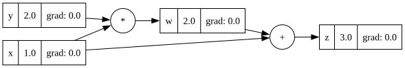
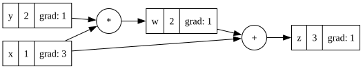
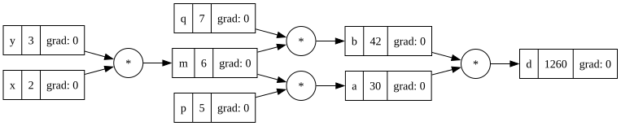

## A. หนึ่งประโยคแรกสุด

<!-- ═══ TODO A ═══════════════════════════════════════════════
positioning ถูกแล้ว (สร้างอะไร -> ทำไมต้องอ่านอันนี้) เหลือ 3 จุด

[/] "ไม่ได้ใช้ NumPy ไม่ได้ใช้ PyTorch" หายไปตอนเขียนใหม่ -> เอากลับมา
    นั่นคือประโยคที่ทำให้คนเชื่อว่า from scratch จริง
    (requirements.txt สะอาดแล้ว ไม่มี torch = เคลมนี้ตรวจสอบได้)

[/] บรรทัดชวนทัก -> ลบเครื่องหมาย ? ออก
    ประโยคชวนคุยที่ลงท้ายด้วย ? อ่านแล้วเหมือนคนเขียนยังไม่อยากให้ใครทัก

[/] ตอนตัดให้สั้น: ประโยคแรกไม่เกิน 20 คำ และต้องมีคำนามที่บอกว่ามันคืออะไร
    ที่เหลือ (bug record / คำถาม / Python ที่ได้เรียน) ยัดลงประโยคที่ 2 ประโยคเดียว
    ถ้ายัดไม่ลง แปลว่ามันไม่ควรอยู่บรรทัดแรก
════════════════════════════════════════════════════════════ -->


เรา implement neural network จากศูนย์โดยที่ไม่ใช้ NumPy และ PyTorch: 
มี class Value ไว้สร้าง computational graph
มี function backward สำหรับหาgradient ย้อนกลับ
มี function topo สำหรับ สร้าง order ในการทำหาgradientย้อนกลับ
มี class Neuron, Layer, MLP ไว้สร้าง neural network

เราบันทึกbugทีเราเจอ ความรู้pythonใหม่ๆ คำถามที่เราสงสัย

ถ้าคุณกำลังเรียนเรื่องนี้อยู่เหมือนกัน ก็ทักเรามาได้


## B. กลไก — ช่องที่ใหญ่ที่สุดที่ยังว่าง

### B1. ทำไม Value ต้องจำ _prev กับ _backward

<!-- ═══ TODO B1 ══════════════════════════════════════════════
เนื้อหาถูกหมดแล้ว เหลือแต่รูปแบบ

[/] markdown กลับด้าน: เขียนไว้ว่า (ข้อความ)[ลิงก์]
    ที่ถูกคือ [ข้อความ](ลิงก์) -- ตอนนี้จะขึ้นเป็นตัวหนังสือดิบ

[/] เหตุผลข้อ 1 ที่แก้เองรอบล่าสุด ("จะได้สร้าง order ในการเรียก _backward ถูก") ถูกแล้ว
    ดันให้สุดอีกนิด: _prev ไม่ได้มีไว้คำนวณ closure จับ self/other ไว้เองอยู่แล้ว
    _prev มีไว้ให้ traversal เดิน = โครงสร้างเดียวมีผู้ใช้สองราย
    (คนที่ลอกโค้ดมาจะไม่มีวันเขียนประโยคนี้ได้)
════════════════════════════════════════════════════════════ -->

    
- #### ตอน forward เราเก็บอะไรไว้บ้าง ทำไมต้องเก็บ
ต้องจำ
1. Value ก่อนหน้าใน _prev
2. วิธีคำนวน gradient ย้อนกลับ

ต้องจำ 1 เพราะว่า ตอนที่เราจะทำ back propagation เราต้องมีลำดับnodeของตัวก่อนหน้า เราต้องรู้ว่า c เนี่ยมาจาก a กับ b นะ เราจะได้สร้าง order ในการเรียก _backward ถูก  
เราไม่ใช้ได้ _prev ในการคำนวณ gradient เลย เพราะข้อมูลข้อ node ลูกถูกเก็บใน `_backward` ของnodeพ่อไว้แล้ว

ต้องจำ 2 เพราะว่า ตอนที่เราเรียก `c._backward()` เราต้องรู้ว่าจะอัพเดท gradient ของ a กับ b ยังไง
ถ้า `c = a*b` แล้ว
```
a.grad += c.grad *b.data
b.grad += c.grad *a.data
```

- #### "graph มันสร้างตัวเองตอน forward" หมายความว่าอะไร
แปลว่า ตอนที่เราสร้าง value ใหม่จากแต่ละ operation
เราใส่ [วิธีหาgradient ย้อนกลับ](`function _backward`) ของ value ที่เราสร้าง ใน value นั้นเลย


### B2. ทำไม gradient ต้อง +=  ไม่ใช่ =

<!-- ═══ TODO B2 ══════════════════════════════════════════════
[!] มีตัวแปร w ที่ไม่มีอยู่จริงในตัวอย่าง และเล่าว่าเรียก backward() สองครั้ง
    ตัวเลข 2 กับ 3 ถูกหมด แต่เรื่องเล่าผิด:
      เรียก z.backward() ครั้งเดียว
      ข้างในมันไล่เรียก _backward (ขีดล่าง) ของ node + ก่อน แล้วของ node * ตามมา
    backward() กับ _backward() เป็นคนละตัว -- จุดที่สับสนง่ายที่สุดในไฟล์นี้
    ถ้าเขียนปนกัน คนอ่านจะนึกว่าเราเรียก backward หลายรอบ แล้วทั้งหัวข้อจะดูผิด

[!] เพิ่มประโยคที่พูดได้ตอนเดิน -- มันเชื่อม B2 เข้ากับ B3 ด้วยประโยคเดียว:
    "ไม่มี node ไหนคำนวณ gradient ของตัวเองเลยสักตัว
     มันรับมาจาก parent แล้วส่งต่อลงไปให้ลูก"

[!]  ทั้งสองรูป -> เปลี่ยน alt text เป็นคำอธิบายจริงว่ารูปนั้นคือ expression อะไร

[ ] (ถ้าอยากได้) เพิ่มเคส z = x*x -- สั้นกว่า x*y+x และ counter-intuitive กว่า
    _prev เป็น set เลยเหลือสมาชิกตัวเดียว แต่ engine เราให้ -6.0 ถูก (เช็คแล้ว)
    คำถามคือมันถูกได้ยังไงทั้งที่ _prev มีตัวเดียว
    (ดูว่าใน __mul__ เขียนลง .grad กี่ครั้ง ตอนนั้น self กับ other เป็นอ็อบเจกต์เดียวกันไหม)
════════════════════════════════════════════════════════════ -->


- #### node ที่มีลูกหลายตัวคือกรณีไหน


    ลองดูตัวอย่างนี้
    
    ```
    z = x*y+x
    x = Value(1)
    y = Value(2)
    dz/dz = 1
    dz/dx = y+1 = 3
    dz/dy = x = 1
    ```
           
    
    


- #### += นี้มาจาก chain rule ตัวไหน (ไม่ใช่เรื่อง Python)

    มาจาก $$\frac{\partial L(f(x), g(x))}{\partial x} = \frac{\partial L}{\partial f}\frac{df}{dx} + \frac{\partial L}{\partial g}\frac{dg}{dx}$$

- #### ถ้าใช้ = แล้วมันพังยังไง ตัวเลขไหนผิด
    `x.grad` จะเท่ากับ 2 หรือ 1 แต่ค่าที่ถูกคือ 3  
    `x.grad` ถูกอัพเดทสองครั้ง ตอนเราเรียก `z._backward()` กับ `w._backward()`  
    เราเรียก `z._backward()` `x.grad` จะเท่ากับ 1  
    แล้วพอเราเรียก `w._backward()` ถ้าใช้ `x.grad = w.grad * y.data` เราก็จะเซ็ท `x.grad` เป็น `1*2=2`  
    
    


### B3. ทำไมต้องเรียก `_backward` ตาม topological order

<!-- ═══ TODO B3 ══════════════════════════════════════════════
[!] ทั้งหัวข้อยังเป็น Wispr ดิบ แต่ของที่ต้องใช้มีครบแล้ว แค่ยังไม่ได้พิมพ์ลง

[ ] ช่อง invariant: คำตอบอยู่ในช่อง post-order ข้างล่าง ย้ายขึ้นมา
    ที่พูดได้ตอนเดิน (ใช้ได้เลย):
      "เรียก u._backward() ได้ก็ต่อเมื่อ gradient ของ u final แล้ว
       = ทุก parent ของ u เรียก _backward เรียบร้อยแล้ว"
    เหตุผล: _backward อ่าน u.grad ไปคูณ ถ้ายังไม่นิ่ง ลูกได้ค่าผิดทั้งกิ่ง

[ ] ส่วนที่เขียนไว้ว่า "order ไหนก็ได้ขอให้เป็น topological ผลเหมือนกัน"
    ถูก แต่เป็น *ผล* ไม่ใช่ *เงื่อนไข* -> ย้ายไปไว้ท้ายสุดของหัวข้อ
    ลำดับที่อ่านรู้เรื่อง: เงื่อนไข -> ทำไม DFS ให้เงื่อนไขนั้น -> ผลที่ตามมา

[ ] "gradient จะผิด" บางไป -> ใส่ตัวเลขจริงจาก counterexample ที่เคยรัน (420 / 1260 / 840)
    ประโยคว่า "จะผิด" ใครก็เขียนได้ ตัวเลขเขียนได้เฉพาะคนที่รันจริง

[ ] "ไปกิ่งใน layer นี้ให้ครบก่อนไป layer ใหม่" -> อันนี้เป็นภาษาของ BFS
    DFS ไม่ได้เก็บทีละ layer มันเก็บทีละ subtree
    เขียนใหม่: node จะถูก append ก็ต่อเมื่อทุกอย่างที่มันพึ่งพาถูก append ไปแล้ว

[ ] เพิ่มของใหม่ที่ได้ตอนเดิน -- ทำให้ข้อ "ทำไมต้อง DFS" ลึกขึ้นเยอะ:
    มีวิธีเช็คเงื่อนไขตรงๆ อยู่ = นับว่า parent ยิงครบหรือยัง (Kahn's algorithm)
    แต่ _prev ของเราชี้ไปทาง input อย่างเดียว จะนับ parent ต้องสร้าง edge ย้อนใหม่ทั้งกราฟ
    -> DFS + reversed ไม่ได้ถูกเลือกเพราะฉลาดกว่า
       แต่เพราะเป็นวิธีเดียวที่ทำงานกับทิศของ edge ที่เราเก็บไว้อยู่แล้ว
════════════════════════════════════════════════════════════ -->


> เรียก u._backward() ได้ก็ต่อเมื่อ gradient ของ u final แล้ว = ทุก parent ของ u เรียก _backward เรียบร้อยแล้ว

- #### ถ้าเรียก `_backward` ตามลำดับที่สร้าง node จะเกิดอะไร
    
    คำตอบ: gradient จะผิด
    เพราะตอนเราเรียก `_backward` มันจะอัพเดท gradient ของลูกของ node นั้น
    เช่น
    $$ \frac{dL}{dx} = \frac{dL}{dz} \cdot \frac{dz}{dx} \quad \frac{dL}{dy} = \frac{dL}{dz} \cdot \frac{dz}{dy} $$

    $$ \texttt{(child).grad} = \texttt{(parent).grad} \times \texttt{(local derivatives)} $$

    เพราะงั้นเราเลยต้องคำนวณ gradient ของ parent node ให้เสร็จก่อน i.e. เราต้องเรียก `_backward` ของทุก parent node ของ node ที่เราจะเรียก `_backward`

    ตัวอย่าง

    

- ####  มีลำดับแบบไหนบ้าง แล้วแบบไหนถึงถูก
    

- #### ทำไม post-order DFS + reversed ถึงให้ลำดับนั้น
    เพราะว่ามันไล่กิ่งให้ครบก่อน การที่มันไล่กิ่งให้ครบ พอเรา Reverse แล้ว ก็แปลว่า ก่อนทีเราจะไป Layer ใหม่ เราต้องไปกิ่งใน Layer นะ เข้มันครบครบแล้ว ซึ่งมันก็คือตรงกับกฎของตอนทีเราคํานวณเกรดียันว่าเวลาจะคํานวณเกรดียัน เราต้องคํานวณเกรดียันของ Parent ของโน้ตน้ํานให้หมดก่อน เพราะไม่งานเกรดียันทิศเราคํานวณ ของโหนดนั้นน่ะมันจะผิด ถ้าเกิดเรายังเราคำนวณไม่หมดอ่ะ 


## C. ตัวเลขที่วัดมาจริง

<!-- ═══ TODO C  << ตัวนี้บล็อกทุกอย่าง ทำก่อน >> ═══════════════
[!] ข้อความข้างล่างขัดกับผลที่วัดไว้เอง
    ที่เขียน  : "ไม่ลู่เข้าเพราะ learning rate เยอะไป"
    ที่วัดได้ : capacity ไม่เกี่ยว / lr น้อยเกินไป / เน็ตใหญ่แค่ไปกลบ lr ที่เล็กเกิน
    -> ห้ามเขียนลง README จนกว่าจะรันซ้ำ

[ ] รัน lr 3 ค่า x shape 2 อัน = 6 run จดตัวเลขมา

ช่องที่ยังว่างและต้องรันเอาตัวเลขจริง:
[ ] MLP shape / loss ก่อน->หลัง / กี่ step
[ ] backward vs finite difference ตรงกันกี่ตำแหน่ง
[ ] h sweep -> กราฟรูปตัว V (h เล็กลงไม่ได้แม่นขึ้นเสมอ)
[ ] จำนวน forward pass: finite diff = N+1 / backprop = ?
[ ] จำนวน test ที่ผ่าน
════════════════════════════════════════════════════════════ -->


- MLP ที่เทรน: กี่ layer กี่ neuron / loss จาก _____ → _____ / กี่ step
- backward เทียบกับ finite difference: ต่างกันกี่ตำแหน่ง
- h sweep: h ที่ดีที่สุดคือเท่าไหร่ (ต้องรันก่อน)
- จำนวน forward pass: finite diff ต้อง N+1 ครั้ง / backprop ต้อง _____ ครั้ง

- ตรงนิดเราอยากพูดเรืองนันด้วย เรียงเรียกการปรับ learning rate ทีเรากำหนดค่า. อย่างตัวอย่างทีเรากำหนดแล้ว learning rate 0.1 แล้วมันไม่รูเข้าซะที ปรากฏว่าทีมันไม่รูเข้า เพราะ learning rate เยอะไป แล้ว Comparison ระหว่างว่าเราจะปรับ learning rate หรือว่าเราจะปรับปรับจำนวณ Node ของแต่ละ Layer ว่ามันส่งผลยังไงกับความเร็วในการอัปเดต 


## D. bug ที่เจอจริง — เลือกมา 3 ตัวที่ดีที่สุด

<!-- ═══ TODO D ═══════════════════════════════════════════════
[ ] ยังไม่ได้เขียนจริง ตอนนี้เป็นบันทึกว่า "จะเลือกอันไหนดี" ไม่ใช่ตัวเนื้อหา
[ ] ประโยคที่คิดเองข้างบน (bug ที่ไม่ขึ้น error แต่คำนวณผิด) -> ใช้เปิดหัวข้อได้เลย ดีมาก
[ ] เขียน 3 ตัว ตัวละ 4 ช่องเท่านั้น อย่าเขียนยาว:
        อาการที่เห็น -> เดาว่าอะไร -> จริงๆ คืออะไร -> รู้ได้ยังไง
    ช่อง 4 สำคัญที่สุด อีก 3 ช่องแค่บอกว่าเคยเจอ ช่อง 4 บอกว่า debug เป็น

[ ] 3 ตัวที่เลือกไว้ดีแล้ว เพราะคนละชั้นกัน เขียนให้เห็นว่าคนละชั้น:
      zip ตัดเงียบ      = พังที่ชั้นข้อมูล  (โค้ดถูก input หด)
      tanh indent      = พังที่ชั้น Python (closure ไปผูกกับคนผิด)
      4-4-1 vs 8-8-1   = พังที่ชั้นความคิด  (โค้ดไม่มีบั๊กเลย สรุปผิด)
    ตัวที่ 3 แข็งที่สุด -- แต่ต้องรอตัวเลขจาก C ก่อนถึงเขียนได้

[ ] "รู้ได้ยังไง" ของ tanh indent มีของแล้ว: print(y._backward) เห็นชื่อ closure ผิดตัว
════════════════════════════════════════════════════════════ -->


> bug ที่เราควรจะตระหนักสุดคือ bug ที่มันไม่ขึ้น error แต่มันคำนวณผิด


ตัวที่มีของให้เลือก:
    - tanh._backward อยู่ผิดระดับ indent   (วินิจฉัยด้วย print(y._backward))
        อันนนีก็ดีนะ เพราะเราใช้เวลากับนาน ใช้เวลาแบบนาน มากกว่าจะแก้บัคนีได้ แต่เราก็ทำให้ดาร์ลูด้วยว่าไอฟังก์ชันวิธีการดีบัค ว่าฟังก์ชัน y มัน คือมาจากไหน กันแน่? 
    - _as_value เงื่อนไขกลับด้าน            (67 failed, 18 passed)
    - trace() เป็น pre-order
    - zip ตัดตัวเกินเงียบๆ
    - target เป็น ±1 ซึ่ง tanh ไปไม่ถึง
    - 4-4-1 ไม่ลู่เข้า แต่ 8-8-1 ลู่เข้า — แล้วปรากฏว่าไม่ใช่เรื่อง capacity
    อันนี้เราว่าก็ดี


## E. ปิดท้าย

<!-- ═══ TODO E ═══════════════════════════════════════════════
[ ] tensor: ตอนนี้เขียนแบบตั้งรับ ("ไม่ได้ทำเพราะไม่ต้องการความเร็ว")
    เปลี่ยนเป็นแบบที่แสดงว่ารู้ว่า tensor คืออะไร
    โจทย์ที่ต้องตอบให้ได้ก่อนเขียน:
      a shape (3,) * b shape (2,3) -> c shape (2,3)
      backward: c.grad shape (2,3) ต้องไหลลง a shape (3,)
      (2,3) ยัดลง (3,) ไม่ได้ ต้องทำอะไรก่อน?
      ใบ้: a ตัวเดิมถูกใช้กี่ครั้งตอนคำนวณ c -> ย้อนไปดูคำตอบ B2 ของตัวเอง
    ข้อสรุปที่ควรได้: สูตรอนุพันธ์ไม่มีตัวไหนเปลี่ยนเลย
                     ที่เพิ่มคือ shape bookkeeping = += ของ B2 ในระดับ shape
                     op ใหม่จริงๆ มีแค่ matmul (ใหม่แบบเดียวกับตอนเพิ่ม tanh)

[ ] แก้ "ไม่ได้ใช้ batch" -> ไม่จริง loop ของเรารวม loss ทั้ง 4 ตัวก่อน backward
    = full-batch gradient descent. ที่ไม่ได้ใช้คือ mini-batch คนละเรื่องกัน
    คนที่เทรนโมเดลเป็นจะสะดุดตรงนี้ทันที

[ ] Wispr ยังเพี้ยน: "sensor" -> tensor / "เทรนด์ในโลก Network" -> train neural network
════════════════════════════════════════════════════════════ -->


- อะไรที่จงใจไม่ทำ (scalar เท่านั้น ไม่มี tensor / ไม่มี GPU) และทำไม
เป้าหมายของอันนีเราแค่จะ implement network และก็ core feature ของ neural network แบกพรอปอะไรอย่างงี from scratch เราไม่ได้จะทำให้มันเร็ว หรืออะไรอย่างงีก็เลยไม่ได้ใช้ sensor หรือไม่ได้ใช้ batch เวลาเทรนิง 
- ต่อไปคืออะไร
ต่อไปคือ Make More อ่าวเคคือตอนนี้เรามี เราเทรนด์ในโลก Network ไปแล้ว แต่เราจะเทรนด์ในโลก Network ไปทำอะไรใช่ไหมล่ะ? เพราะงันต่อไปเนี๊ยะ คือเราจะทำอีก ๆ มอง เราจะเทรนด์ในโลกด้านการให้มันแบบ Generate คําศัพท์เหมือน Chat Bot. ให้มันเข้าใจภาษามนุษย์อ่ะ. 
